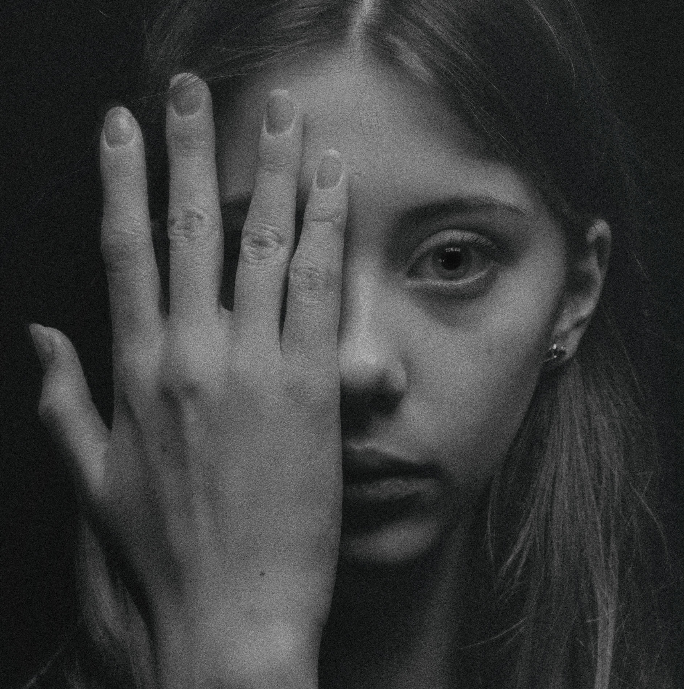
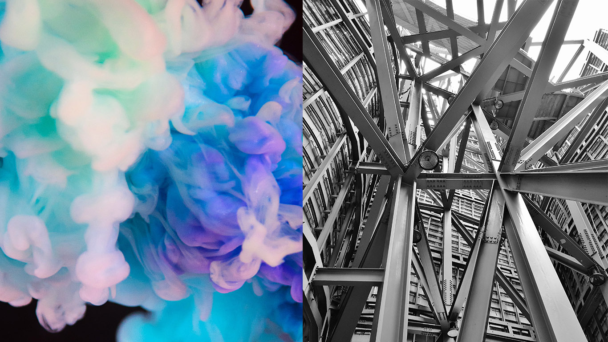
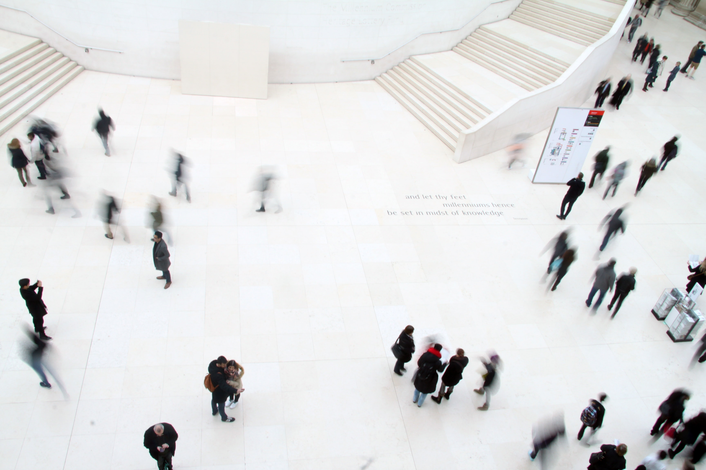
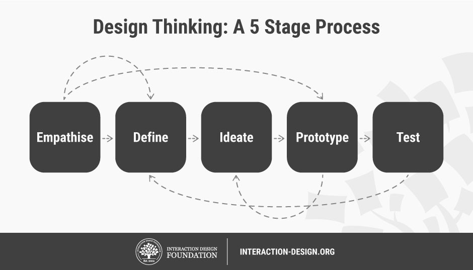
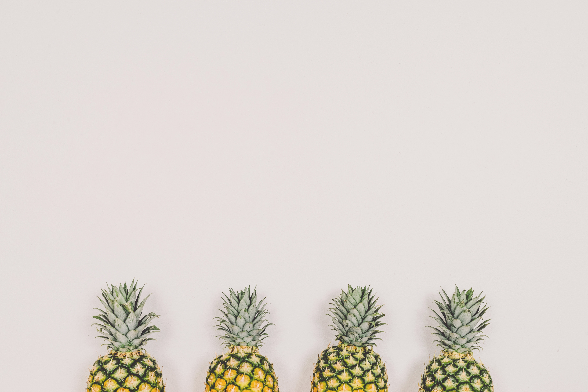
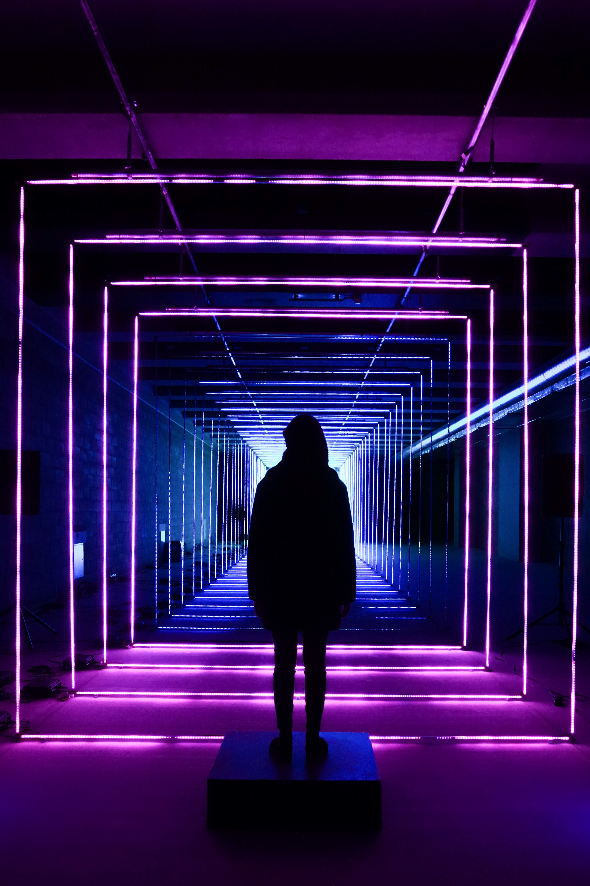
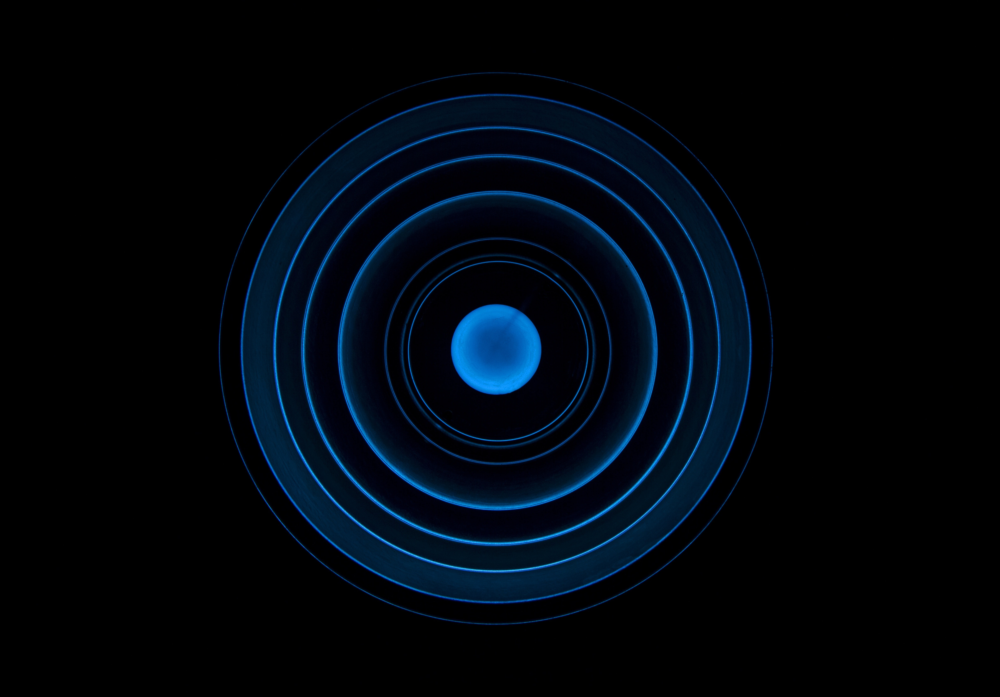
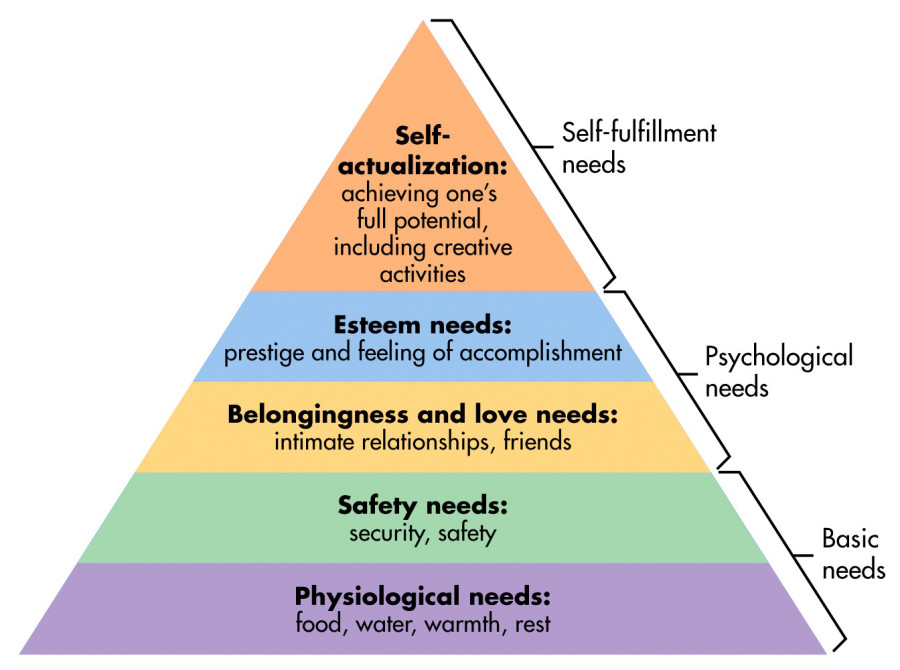
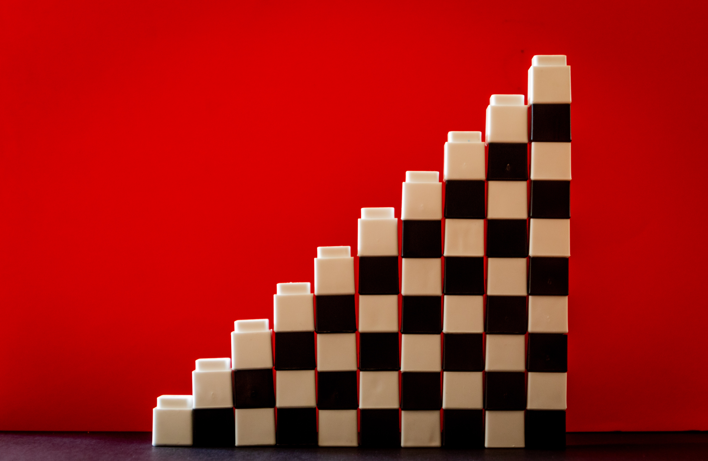

autoscale: true

# User Experience (UX) for non-designers

---

## Sarrah Vesselov
### UX Designer, UI Developer, Speaker, Author

**Linkedin**: sarrahvesselov / **Twitter**: SVesselov

### Mentor Office Hours available by request
sarrah@suncoast.io
(727) 687-2298

---

# How do UX/UI differ? 

## In what ways are they similar?

---

## UX is short for 
## **User Experience**. 

^ UX refers to the overall experience you or I have when interacting with a product. This includes the emotions and attitudes that a product evokes from us while we are using it. 

---

## UI is short for
## **User Interface**.

^  UI refers to the interaction between humans and computers, particularly the space in which it occurs. This includes the graphical user interface (GUI) which contains controls users can select and interact with. (*add image)

---

# UX/UI

^ So, **UX** is all about the way a user experiences an application, and **UI** is all about the way a user interacts with an application. It sounds like *almost* the same thing. Well, almost. There is overlap between the two, but there are some significant differences.

---

* Collaboration 

* Problem-solving

* Analytical and critical thinking

* Conducting/Interpreting UX research

* Wireframing

* Prototyping

* User flows and user journeys

* Visual design

* Interaction design

^ Both UX and UI Design Practice include some or all of the following
^ *(depending on the company you work for, your role, etc.)*

---

# You can't have UX without UI, and vice versa.

^ How do we define the boundaries between the two? UX often focuses on the big picture, the macro.  The focus is on understanding the problem and finding the best solution. This means talking to users, researching if necessary, creating wireframes and flows, all to create the best experience for the user. UI focuses on the details, the micro. The focus here is on taking the wireframes, flows, and learnings from the research and creating the aspects of the user interface. 

---

# Design Thinking

^ Sounds magical, doesn't it? I hate to break it to you but...it isn't. Design Thinking is a fancy name for the process designers (or anyone) can use when solving a problem. Design thinking can be considered an ideology and process. 

---

# Ideology

^ As an ideology, it centers on understanding people first. The focus is on gathering information to understand the people and the problems they are facing before attempting to solve those problems for them.

---

# Process

.jpg)

^ There are no defined or set steps to design thinking, though you can find dozen of articles and books that say there are. At its base, design thinking is an iterative process of ongoing experimentation with the sole purpose of finding the right solution.

---

^ https://www.interaction-design.org/literature/article/5-stages-in-the-design-thinking-process

---

^ https://www.interaction-design.org/literature/article/design-thinking-a-quick-overview

---

# Four Principles

Christoph Meinel and Harry Leifer of the Hasso-Plattner-Institute of Design at Stanford University, California defined **four design thinking principles**

---

# The Human Rule

All design activity is social in nature and will help us maintain a human-centric point of view.

---

# The ambiguity Rule

Ambiguity is inevitable, experiment at the limits of your knowledge. Becoming comfortable with the unknown will allow you to experiment more to see things differently.

---

# All design is redesign

Technology and social circumstances change, but human needs do not. We are redesigning products, services, or features to fulfill these needs.

---

# The tangibility rule

Prototypes make ideas tangible. Designers can communicate more effectively using prototypes.

---

# Maslow's Hierarchy of needs

^ Maslow's hierarchy of needs is a motivational theory in psychology comprising a five-tier model of human needs, often depicted as hierarchical levels within a pyramid.

---

^ From the bottom of the hierarchy upwards, the needs are: physiological, safety, love and belonging, esteem and self-actualization. Needs lower down in the hierarchy must be satisfied before individuals can attend to needs higher up.

^ **Link:** https://www.simplypsychology.org/maslow.html

---

# Phases in the design thinking process

---

# Empathize

Know and understand the user. Observe, engage, understand.

---

# Define

Define the problem using findings from the empathy phase. 

---

# Ideate

Start forming solutions using ideation techniques (brainstorming, mind-mapping, etc.) Narrow the field down to a few ideas with which to move forward.

---

# Prototype

Turn these ideas into something tangible. This phase is all about experimenting and letting go as you learn what works, and what doesn't work.

---

# Test

This phase goes hand in hand with prototyping. User testing with prototypes will give answers that may lead you right back to creating new prototypes. 

---

# Design Exercise

Mob activity

^ First review the design exercise for CloudBees: https://realtimeboard.com/app/board/o9J_kxn0r8Q=/

^ Let's apply 'design thinking' to one of the following problems.

---

# Spotify artist catalogue manager

Spotify has decided to give artists control of their catalogues on their platform. For the first time, artists can manage their own albums, upload their own artwork, sell specific merchandise, add lyrics to their music etc. and it’s all on their own terms. Design a Mac-based editor and artist management system that allows artists to manage their presence on Spotify. The solution should account for all existing artist content on Spotify but feel free to get creative and add additional features that an artist might find useful.

**Constraint:** You are designing a Mac desktop app, you will be relegated to the OS’s abilities but you can disregard any web-related technical constraints because they don’t apply here.

---

# Google Enterprise Sales Funnel

You are consulting Google on an important strategic decision for their enterprise offerings; they want to know whether it’s worth introducing a sales funnel management tool onto their Enterprise Gmail interface. Google believes that because a majority of their enterprise users discuss business on their email platform and because they are the lexicon of most people’s business contacts, that they are in a position to both make the sales process more efficient and make the likelihood of closing business higher. 26% of Google’s Enterprise users engage in sales weekly, 40% engage in some sort of funnel management (whether sales, hiring, or some other decision funnel). A typical sales funnel includes Leads, Inquiries, Prospects, Quotes and finally a new customer. Recommend a funnel management flow to Google. Make sure the flow accounts for a user making initial contact with a lead from within gmail and then managing that lead through the entire funnel. What else can gmail do to put the odds of closing business in favor of their user?

**Constraint:** No constraints

---

# Roomates

A few trends of note: 54% of the world’s population live in urban communities, the average marriage age for men is 29 (up from 26 two decades ago) and for women is 27 (up from 23 in the same time period). Given these trends, city dwellers tend to spend most of their twenties living with roommates. Finding and keeping a good roommate, however, gets harder as more people swarm into cities. Design a mobile product experience that appeals to millennials that makes it safe to find the ideal roommate in New York City. Design the experience from the perspective of person who is looking for a roommate as well as the one who is looking for the apartment. Once the ideal roommate is found, what else can this product do to make the roommate experience better? We are looking for you to identify pain points in the “finding/keeping a good roommate” journey and to find ways to solve for those pain points.

**Constraint:** Stick to existing mobile capabilities of iOS and Android.

---

# Personalising audiobooks

Audiobooks and podcasting are the fastest growing audio segments on mobile. Users who listen to audiobooks don’t enjoy the benefits of dog-earing pages, highlighting excerpts or leaving notes on their favorite pages… they also lose the nostalgic aspects of owning a book and watching it age. This leaves a lot to be desired from the audio experience on mobile. Design an Audiobook or Podcasting mobile app that is highly personal, highly interactive and with the ability to bring even more utility to the user than a book ever could.

**Constraint:** All suggested technologies need to exist, or have the ability to realistically exist within the next 6 months.

---

# Calendar for a Traveling Salesperson

Valentina leads sales and business development for a Fortune 500 company. She travels 3 out of 4 weeks in the month, and when she travels, it’s almost always internationally. Between all her travel to different timezones and a busy meeting schedule in different cities, she finds it challenging to keep up with her calendar to show up to the right places at the right time. Design a calendar flow and interface that is smart enough to suggest meeting times, accounts for changing time zones, and is proactively working for Valentina to make sure she is always on time for her meetings.

**Constraint:** Solution has to be mobile-friendly and has to use viable technologies from today.

---

# Impact Canvas

^  The impact canvas or impact gap canvas is a tool used by researchers, business majors, and entrepreneurs to frame out a problem, identify gaps in current solutions to that problem, and come up with new solutions. It is a useful tool for designers as well.

