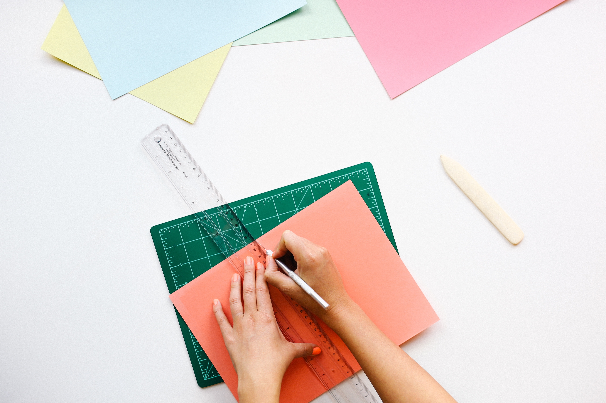

autoscale: true

# Impact Canvas Review

^ Have each student share which problem they chose and present their impact canvas. This should be informal and conversational. 

---

# The importance of empathy

Empathy is perhaps the most critical factor in the UX process. Without the ability to understand a unique users context, goals, emotions, and motivations, we cannot be sure we are creating a solution they can use.

^ It is common for people to create solutions by thinking about what THEY need or want. We assume that our motivations, needs, and goals are common and shared.

^ Empathy for designers does not mean placing yourself in someone else's shoes and experiencing the world as they do. Doing so is difficult and not easily communicated to others in your organization. Empathy means taking the time to carry out proper user research and using it to guide your decisions.

^ Empathy can be challenging to maintain, and it takes practice. Conducting empathy exercises will help you to increase your empathic understanding.

---

# Highs and Lows

**How often:** Daily or weekly.

**How to do it:** Share one high and one low with the rest of the team. These high's and low's could be personal or professional. Share in a stand-up or a group chat. The goal here is to see people differently. Hearing about their lives and seeing a different side of them will help you to empathize with others.

---

# Emotion Check

**How often:** Several times a day.

**How to do it:** Set a timer for yourself, have it go off at set intervals. When the timer goes off, answer these questions in a journal: What is your mood? Why are you feeling this way? That's it. It takes just a couple of minutes and helps you to get in touch with your emotions throughout the day.

---

# Ideation

Ideation is merely the formation of ideas or concepts. In the context of design, ideation is the term we use for the creative process of generating ideas together. 

^ This process can take the form of group or individual brainstorming. Whether you start on your own or within a group, there are some important things to keep in mind:

---

# Keep an open mind

Ideation requires a *judgment-free zone*. All participants must feel safe to share their wildest and worst ideas. The focus is not on finding the RIGHT solution; the focus is on surfacing all the POSSIBLE solutions.

---

# Don't start with ideation

Ideation should only come after you have *empathized* with your users and *defined* the problem.

---

# Have the right environment

Make sure you have a *clearly articulated problem* to inspire and guide the ideation. 

**Example:** How can we make checking accounts accessible for low-income people groups? Have personas and any other materials readily available during the session.

---

# Maintain structure

Set a *time-limit* and *designate a facilitator*. Eliminate distractions and discourage side-conversations or unrelated tangents.

---

# Ideation Techniques

---

* *Brainstorming:* Everyone throws out their wildest ideas and the group builds off of them. If done on your own, this is called "Braindumping." If members write them down first and bring them to the meeting, it is called "BrainWriting."

* *Worst Idea:* The opposite of throwing out your best or wildest ideas. The focus here is to produce the worst possible ideas first. This technique loosens the group and makes people more comfortable with contributing to the session.

---

* *Mindmapping:* Drawing out the connections between the problem and connecting ideas.

* *Crowdstorming:* Use social media (or other avenues) to target an audience for idea generation and validation.

**Resource link:** https://www.nngroup.com/articles/ideation-in-practice/

---

# Prototyping

A prototype is an interactive simulation of an interface. It can be as rudimentary as a piece of paper or as sophisticated as a coded interface.

^ Prototypes are not the final solution. The purpose of a prototype is to simulate and test how users will interact with a solution.

---

* *Paper sketches:* Paper sketches are great for early-stage testing. They are easy to produce and allow you to check assumptions and validate requirements. They become less useful as a project progresses.

* *Wireframes:* More detailed than sketches but not as high-fidelity as coded prototypes. Wireframes focus on the interaction and flow rather than the look of the interface.

* *Coded prototypes:* These working models are close to the final look and feel. They gauge both the practical and aesthetic viability of a solution.

**Resource link:** https://uxplanet.org/basics-of-prototyping-1a4106e12c0e

---

# UX Research Methods

^ There are many methods available for conducting research and gathering data. The methods listed below represent a baseline toolkit for conducting research.

---

# User Interviews

User interviews are typically conducted at the beginning, or in the early stages of, a project.

*How it works:* These interviews typically last for 30-60 minutes and allow you the opportunity to understand their needs, beliefs, struggles, and experiences. They can be conducted in person, by phone, or video-call.

---

# Contextual Interviews

These are different from user interviews. In contextual interviewing, you will observe users working in their environment (office, home, car, etc.).

*How it works:* In this interview, the interaction between yourself and the participant is minimal. You are there to watch, listen, and take notes on how the user goes about an activity. You can ask questions but only to clarify or gain better understanding about a particular choice.

^ Resource link: https://www.usability.gov/how-to-and-tools/methods/contextual-interview.html

---

# User Journey Mapping

User journey mapping captures the experience of a user as they interact with a product. The focus is on the user's feelings and thoughts as they interact with a product. The user journey is linear.

The purpose of journey mapping is to understand the highs and lows users experience when interacting with a product. Doing so will highlight pain points and opportunities.

*How it works:* If you are starting on a new solution, begin with a user journey. Journey maps can take nearly any form. A series of post-it notes, a journal, or a spreadsheet. Choose the medium and structure that works best for you and your team.

---

# User Flows

User flows differ from user journeys. User flows are a visualization of the path a user follows across a product or feature. The focus here is on the task the user is attempting to accomplish and the many paths available. The user flow is not linear as it contains many decisions and possible routes.

The purpose of a user flow is to understand the paths users take through a product. In the early design stages, it helps designers understand the solution and to explain the solution to others. When examining an existing flow, it can highlight opportunities to improve the overall flow.

*How it works:* If you are working on improving an existing solution, start with a user flow. User flows can also take many forms. You may begin by creating one on a whiteboard or using sticky notes while in a meeting. The final flow should take digital form. Sketch is an excellent tool for creating these flows.

---

# Personas

Personas are realistic representations of your users. They should be based on both quantitative and qualitative data.

*How it works:* Identify the major user segments for your product or service. Conduct user research using surveys, interviews

---

# Card sorts

Card sorting is a method used to evaluate information architecture, typically for a website or application.

*How it works:* Participants are given a set of topics and asked to organize them in a way that makes sense to them. Participants may also suggest alternative names/labels for these topics and categories. You can use actual cards, post-it notes, or software tools.

---

# Card Sort Types:

*Open Card Sort:* Participants organize topics in a way that makes sense to them and then name each group. Use this type of card sort to understand how users group content and what names they associate with that content.

*Closed Card Sort:* Participants sort content into predefined categories. Use this technique when you are constrained by set categories and want to learn how users sort content based in those categories.

You can also use both types.

^ Resource link: https://www.usability.gov/how-to-and-tools/methods/card-sorting.html

---

# Surveys

Done online, these structured questionnaires can vary in length and format.

*How it works:* These surveys are distributed to targeted groups that fit the demographic from which you are seeking information. The answers are collected in a database to be interpreted.

---

# When should I use one?

Surveys can be used at any stage of development/design. Surveys can help you understand the following on a macro and a micro level:

* User needs
* User frustrations
* User motivations

^ Resource link: https://www.usability.gov/how-to-and-tools/methods/online-surveys.html

---

# Usability testing

Test a product or design with users to evaluate the effectiveness of the proposed solution. Participants attempt to complete a task or series of tasks while obervers watch and listen. Usability testing will help highlight usability problems and allow you to collect quantitative/qualitative data on user interactions.

*How it works:* To run an effective test, you must have a solid plan in place for testing, recruiting participants, and analyzing the findings. You can conduct usability testing at nearly any stage of design. You can conduct testing on one particular feature or across an entire application.

^ Resource link: https://www.usability.gov/how-to-and-tools/methods/usability-testing.html https://www.interaction-design.org/literature/topics/ideation
